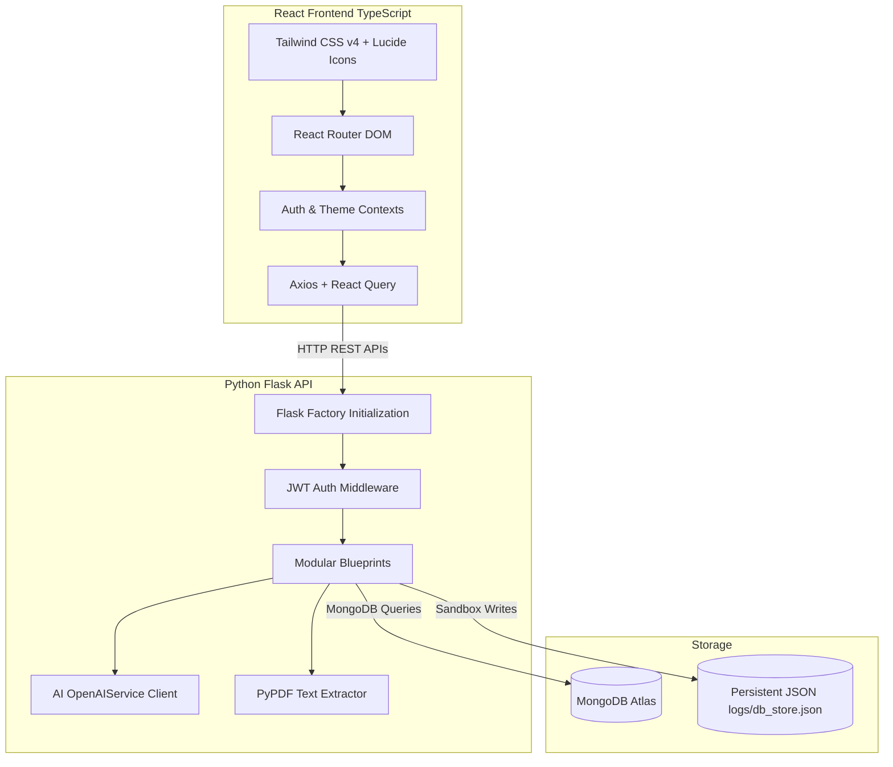
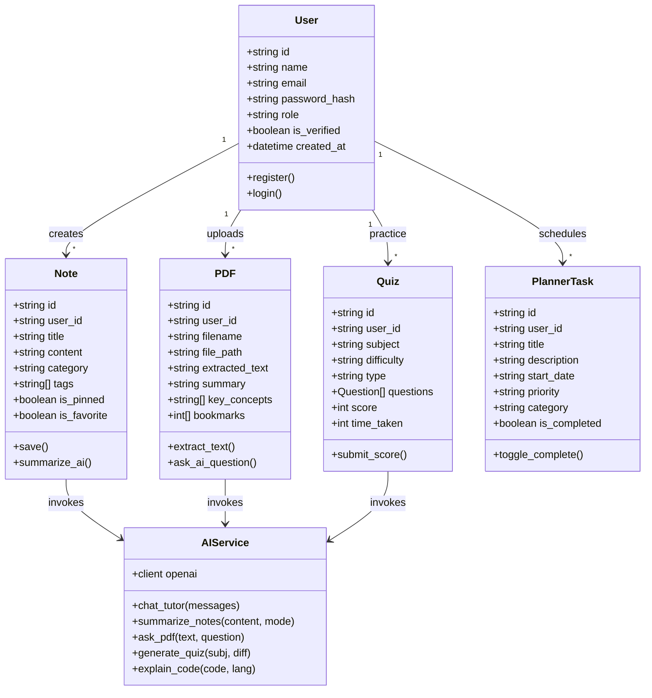
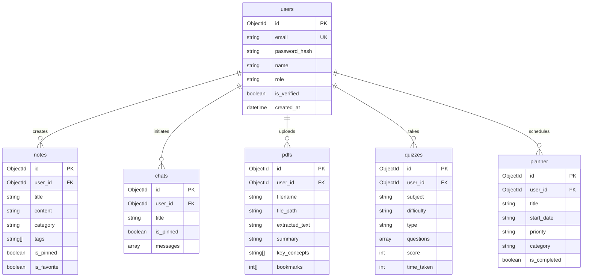
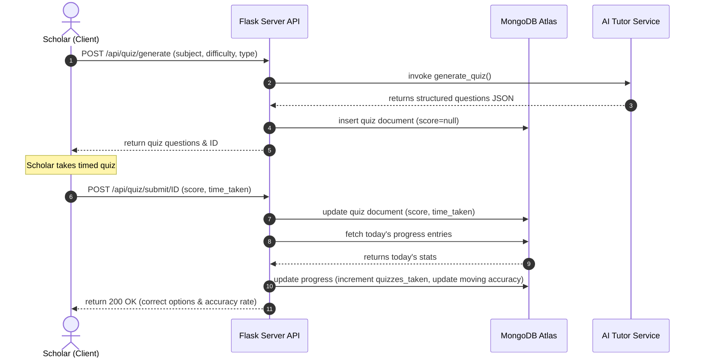
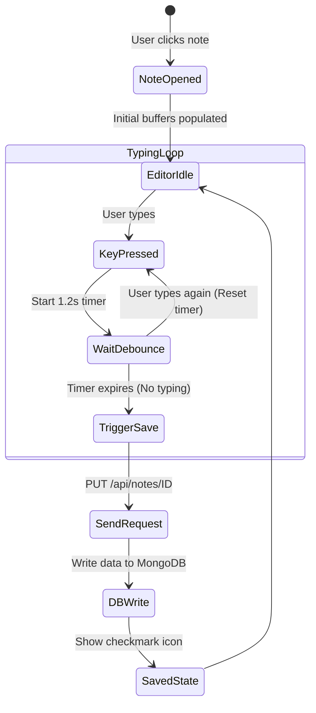

# System Architecture & Design Document (HLD & LLD)

---

## 1. High-Level Design (HLD)

The StudySphere AI platform is built on a decoupled **Client-Server Architecture**.



---

## 2. Low-Level Design (LLD) & UML Diagrams

### 2.1 Use Case Diagram
Describes user interactions with the system modules.

```mermaid
usecaseDiagram
    actor Student
    actor Admin

    Student --> (Register & Login)
    Student --> (Chat with AI Tutor)
    Student --> (Write Auto-saved Notes)
    Student --> (Upload PDF & Ask Questions)
    Student --> (Take Timed Quizzes)
    Student --> (Practice Flashcards)
    Student --> (Schedule Planner Calendar)
    Student --> (Practice Code Complexity Review)
    Student --> (Build ATS Resumes)
    Student --> (Review Heatmap Streaks)

    Admin --> (Demote/Promote User Roles)
    Admin --> (Inspect Audit Logs)
    Admin --> (Broadcast Announcements)
    Admin --> (Access KPI dashboard)
```

### 2.2 Class Diagram
Represents the structural models and helper utilities.



### 2.3 Entity Relationship Diagram (ERD)
Details NoSQL database relationships and references.



### 2.4 Sequence Diagram: Timed Quiz Submission & Analytics Update
Tracks data flow when a user finishes a quiz.



### 2.5 Activity Diagram: Auto-Save Notes Loop
Tracks actions of the debounced saving loop.



---

## 3. Database Schema Definitions (Collections)

*   **`users`**: Root accounts mapping. Includes authentication fields and session tokens.
*   **`notes`**: Custom Markdown content, catalogs, and favorite markers.
*   **`chats`**: Nested object array detailing dialogues.
*   **`pdfs`**: Raw textbook text blocks mapping alongside bookmarked indices.
*   **`quizzes`**: Questions lists matching difficulty configurations and scoring parameters.
*   **`flashcards`**: Learning cards categorizations. Track statuses: `'new' | 'learning' | 'mastered'`.
*   **`planner`**: Calendar schedules.
*   **`progress`**: Day-to-day analytics counts (hours, notes created, quizzes completed).
*   **`notifications`**: Tray alerts matching system notices and study reminders.
*   **`logs`**: Audit trail.
